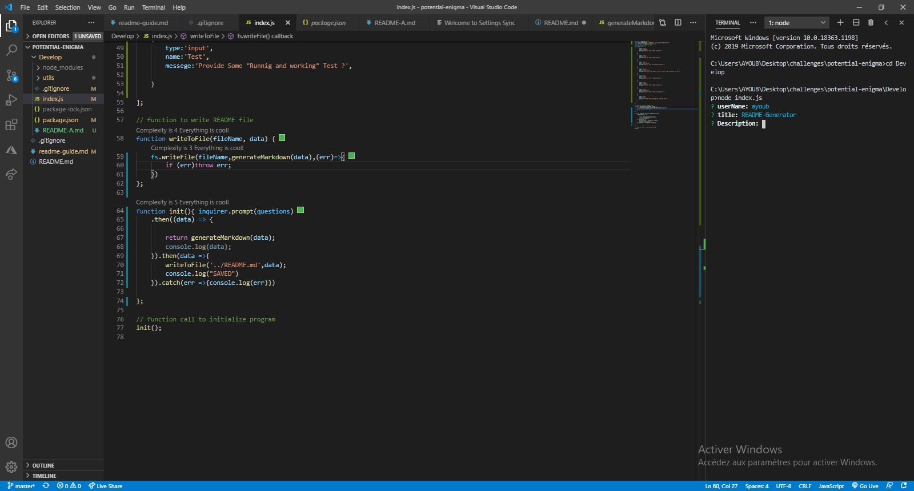

  
  
  ##README Generator

  ## Description :

  This application , Allows user to generate Readme , by getting prompt in command line base on node.js .

  # Table Of Contents
  * [Installation](#Installation)
  * [Usage](#Usage)
  * [Contributor](#Contributor)
  * [License](#License)
  * [Test](#Test)
  
  
  # Installation :

  To install this app follow this :  node index.js

  # Usage :

  Generate readme
  

  # Contributor :
   
  Email: undefined
  Ayoub Hammouch

  # License :

  MIT

  # Test :

  Tested

  # Questions :

  If you have any question , contact me : undefined

  # This Project "README Generator" Made by "AYOUB"
